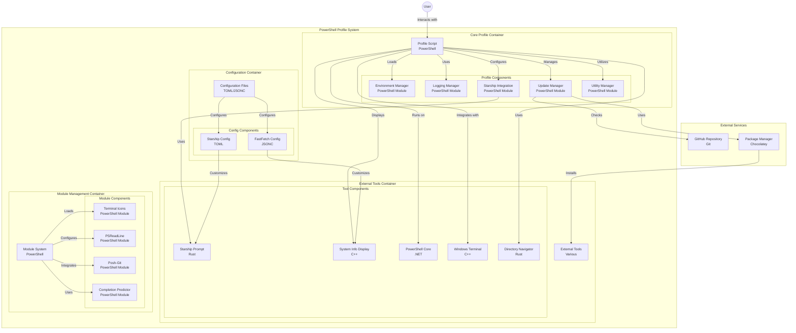

# My PowerShell Profile

Welcome to my PowerShell profile! Here, you'll find a curated collection of functions, aliases, and settings tailored to enhance my PowerShell workflow, making it both more enjoyable and productive.

## Quick Setup (Windows)

Jumpstart your PowerShell experience with just one command:

```powershell
irm "https://raw.githubusercontent.com/MKAbuMattar/powershell-profile/main/setup.ps1" | iex
```

> [!WARNING]
> If you're using the `develop` branch, you may encounter some issues and not all features may work as expected. It is recommended to use the `main` branch for a stable experience.

```powershell
irm "https://raw.githubusercontent.com/MKAbuMattar/powershell-profile/refs/heads/develop/setup.ps1" | iex
```

## The Profile Architecture



## Features

This PowerShell profile script includes:

- **UTF-8 Encoding**: Sets the console encoding to UTF-8.
- **Module Management**: Checks and installs necessary modules like Terminal-Icons, PowerShellGet, CompletionPredictor, PSReadLine, and Posh-Git.
- **PSReadLine Configuration**: Customizes PSReadLine options and key handlers for an enhanced command-line experience.
- **Custom Modules**: Imports custom modules for environment settings, logging, starship prompt, updates, and utilities.
- **Starship Prompt**: Loads and configures the Starship prompt.
- **Chocolatey Integration**: Sets and imports the Chocolatey profile if available.
- **Auto Updates**: Invokes functions to update the profile and PowerShell if the auto-update flags are set.
- **Editor Configuration**: Sets the default editor based on availability (nvim, vi, code, notepad).
- **FastFetch**: Runs FastFetch if available to quickly fetch and display system information.
- **Directory Modules**: Imports directory modules for file management and navigation.
- **Network Modules**: Imports network modules for network-related functions and aliases.
- **Utility Modules**: Imports utility modules for additional functions and aliases.

## Directory Module

The Directory module provides functions to navigate directories and manage files:

- **Find-Files** (Alias: `ff`): Finds files matching a specified name pattern in the current directory and its subdirectories.
  - Example: `ff "*.ps1"`
- **Set-FreshFile** (Alias: `touch`): Creates a new empty file or updates the timestamp of an existing file.
  - Example: `touch "file.txt"`
- **Expand-File** (Alias: `unzip`): Extracts a file to the current directory.
  - Example: `unzip "file.zip"`
- **Compress-Files** (Alias: `zip`): Compresses files into a zip archive.
  - Example: `zip -Files "file1.txt", "file2.txt" -Archive "files.zip"`
- **Get-ContentMatching** (Alias: `grep`): Searches for text in files using regular expressions.
  - Example: `grep -Pattern "pattern" -Path "file.txt"`
- **Set-ContentMatching** (Alias: `sed`): Searches for a string in a file and replaces it with another string.
  - Example: `sed -file "file.txt" -find "pattern" -replace "replacement"`
- **z**: Windows equivalent of the 'cd' command, z will print the matched directory before navigating to it.
  - Example: `z ~/Documents`
- **zi**: Windows equivalent of the 'cd' command, but with interactive selection (using fzf)
  - Example: `zi ~/doc/my-pjet`
- **Get-FileHead** (Alias: `head`): Retrieves the first few lines of a file.
  - Example: `head "file.txt"`
- **Get-FileTail** (Alias: `tail`): Retrieves the last few lines of a file.
  - Example: `tail "file.txt"`
- **Invoke-UpOneDirectoryLevel** (Aliases: `cd.1`, `..`): Moves up one directory level.
  - Example: `cd.1`
- **Invoke-UpTwoDirectoryLevels** (Aliases: `cd.2`, `...`): Moves up two directory levels.
  - Example: `cd.2`
- **Invoke-UpThreeDirectoryLevels** (Aliases: `cd.3`, `....`): Moves up three directory levels.
  - Example: `cd.3`
- **Invoke-UpFourDirectoryLevels** (Aliases: `cd.4`, `.....`): Moves up four directory levels.
  - Example: `cd.4`
- **Invoke-UpFiveDirectoryLevels** (Aliases: `cd.5`, `......`): Moves up five directory levels.
  - Example: `cd.5`

## Network Module

The Network module provides functions to manage network settings and perform network-related tasks:

- **Get-IPAddress** (Alias: `my-ip`): Retrieves the IP address of the current machine.
  - Example: `my-ip -IPv4`
- **Clear-FlushDNS** (Alias: `flush-dns`): Clears and flushes the DNS cache.
  - Example: `flush-dns`

## Utility Module

The Utility module provides a set of useful functions to enhance your PowerShell experience:

- **Test-CommandExists** (Alias: `command-exists`): Checks if a command exists in the current environment.
  - Example: `command-exists "ls"`
- **Invoke-ReloadProfile** (Alias: `reload-profile`): Reloads the PowerShell profile to apply changes.
  - Example: `reload-profile`
- **Get-Uptime** (Alias: `uptime`): Retrieves the system uptime in a human-readable format.
  - Example: `uptime`
- **Get-CommandDefinition** (Alias: `def`): Retrieves the definition of a command.
  - Example: `def "ls"`
- **Set-EnvVar** (Alias: `set-env`): Exports an environment variable.
  - Example: `set-env "name" "value"`
- **Get-EnvVar** (Alias: `get-env`): Retrieves the value of an environment variable.
  - Example: `get-env "name"`
- **Get-AllProcesses** (Alias: `pall`): Retrieves a list of all running processes.
  - Example: `pall`
- **Get-ProcessByName** (Alias: `pgrep`): Finds a process by name.
  - Example: `pgrep "process"`
- **Get-ProcessByPort** (Alias: `portgrep`): Finds a process by port.
  - Example: `portgrep 80`
- **Stop-ProcessByName** (Alias: `pkill`): Terminates a process by name.
  - Example: `pkill "process"`
- **Get-SystemInfo** (Alias: `sysinfo`): Retrieves system information.
  - Example: `sysinfo`
- **Clear-Cache** (Alias: `cache-clear`): Clears the cache of a specified application.
  - Example: `cache-clear "All"`
- **Stop-ProcessByPort** (Alias: `portkill`): Terminates a process by port.
  - Example: `portkill 80`
- **Get-RandomQuote** (Alias: `quote`): Retrieves a random quote from an online API.
  - Example: `quote`
- **Get-WeatherForecast** (Alias: `weather`): Retrieves the weather forecast for a specified location.
  - Example: `weather -Location "Amman"`
- **Start-Countdown** (Alias: `countdown`): Starts a countdown timer.
  - Example: `countdown -Duration "25s" -Title "Break Time"`
  - Example: `countdown -Duration "02:15PM" -Title "Lunch Time"`
- **Start-Stopwatch** (Alias: `stopwatch`): Starts a stopwatch timer.
  - Example: `stopwatch -Title "Workout"`
- **Get-WallClock** (Alias: `clock`): Retrieves the current time in a specified timezone.
  - Example: `wallclock -TimeZone "Asia/Amman"`

## Contributing

Contributions are welcome! If you have suggestions for improvements or new features, please open an issue or submit a pull request on GitHub. Make sure to follow the project's code of conduct and guidelines for contributing.
